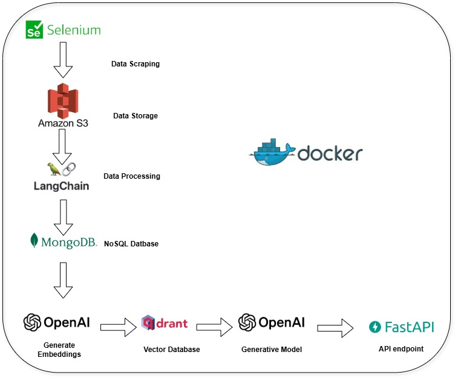

# Evaluating AI Search Visibility for Chime

This project implements a **Retrieval-Augmented Generation (RAG) system** to enhance AI search visibility for **Chime Bank**. The system allows comparing Chime's visibility and relevance with competitors: **Ally Bank, Capital One, SoFi, and Varo**. The goal is to provide accurate and contextual responses by leveraging data scraped from FAQs and blogs of these competitors.

## Architecture and Design
The system architecture is designed to collect, process, and retrieve data for enhanced generative responses. Below is the high-level architecture diagram:



### Key Features:
- **Data Collection**: Scraping FAQs and blogs using Selenium.  
- **Data Storage**: Uploaded raw data to Amazon S3 for storage.  
- **Data Processing**: Performed ETL, chunking data into meaningful sections, and transforming it into embeddings for semantic search.  
- **RAG Pipeline**: Uses embeddings and GPT-4 to generate relevant, contextual responses.  

## Relevancy and Faithfulness Evaluation with RAGas
This project uses RAGas for evaluating the relevancy and faithfulness of AI-generated responses.
[RAGas GitHub Repository](https://github.com/explodinggradients/ragas)

## Authority Signals: Brand Mentions & Backlinks Scoring
The system also evaluates authority signals by analyzing brand mentions and backlinks. It assigns scores based on the presence of trusted domains like Ally, Chime, Capital One, SoFi, and Varo, enhancing the measurement of search visibility.


## Clone the Repository
```bash
git clone https://github.com/NourhanNabil/EvaluatingAISearchVisibilityforChime.git
cd EvaluatingAISearchVisibilityforChime
```

### Prerequisites
- Docker installed on your machine.
- Docker Compose installed on your machine.

**Docker**
Build and Run the Docker Containers:
```bash
docker-compose up -d
```

**Interactive Shell**
For interactive shell access while the container is running, you can use:
```bash
docker-compose exec app bash
```

**Access the App**
Open your web browser and go to `http://localhost:8080` to access the App.

**Shut Down the Containers**
```bash
docker-compose down 
docker-compose stop
```

### Installation (Optional)
If you prefer to run the application locally without Docker, you can install the required Python dependencies with:
```bash
pip install -r requirements.txt
```